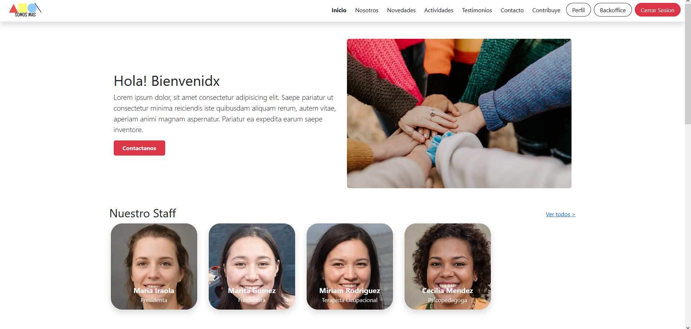
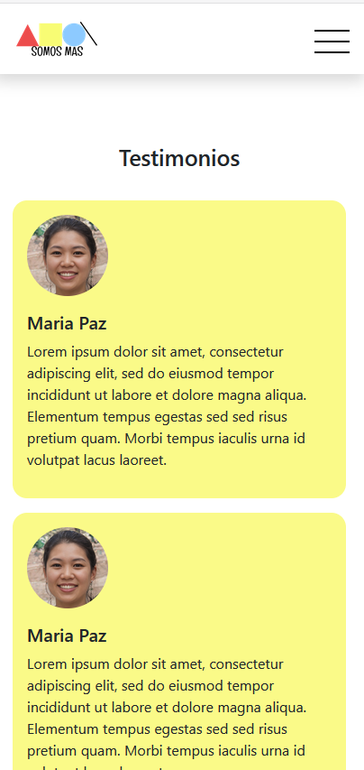
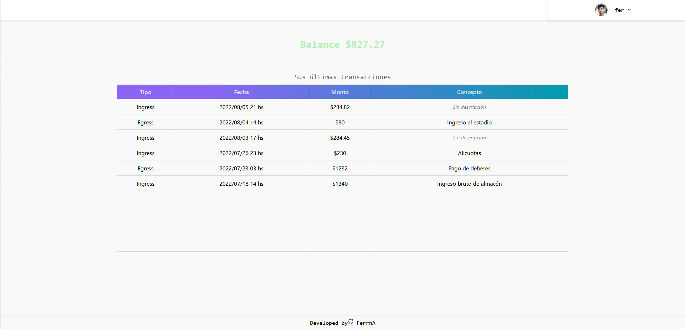
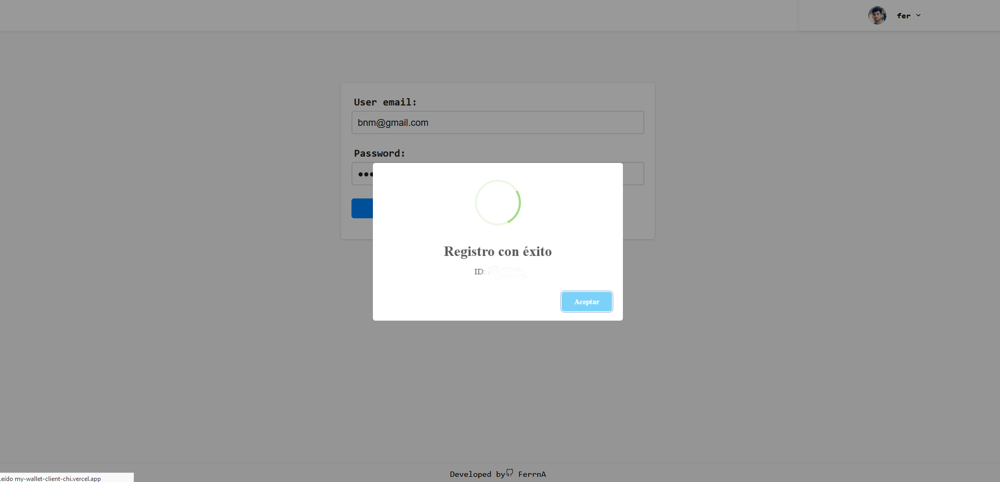
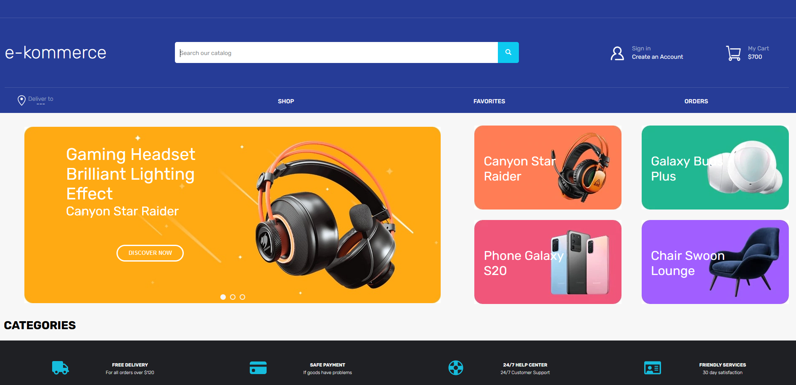
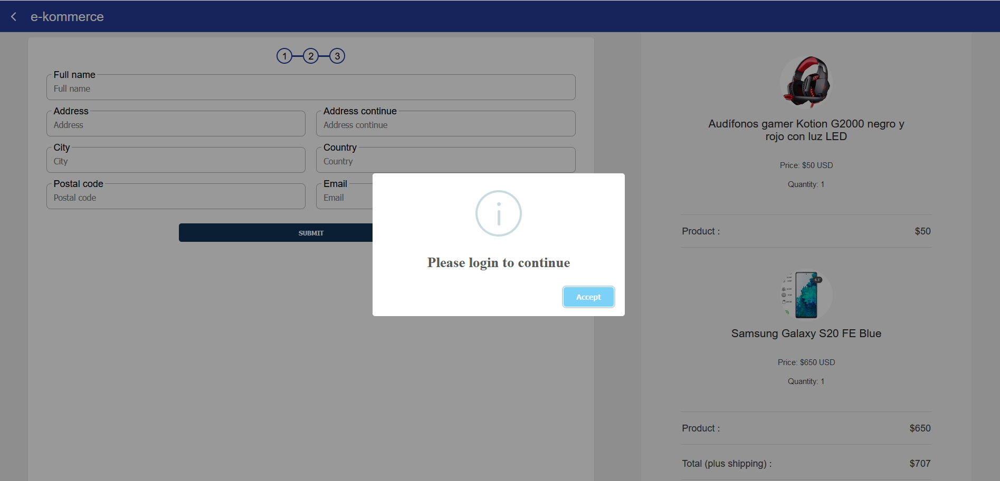

### Hello there!

👋 Hi there! I'm Fernando Arriondo, a dedicated Junior Web Developer with a focus on crafting responsive, user-friendly web applications. Over the past year, I've honed my skills in both front-end and back-end development, building full-stack solutions that solve real-world problems.

🔧 Technologies I work with:

    Front-end: JavaScript, TypeScript, React, Next.js, Tailwind CSS
    Back-end: Node.js, Java, Spring Boot
    Databases: PostgreSQL, MySQL, Firebase
    Cloud & Tools: AWS, Vercel, Docker, Git

💡 I’m passionate about continuous learning and love collaborating with others to bring ideas to life. Check out my repos for some cool projects and feel free to connect if you want to chat or collaborate!

 💻💎[MI PORTFOLIO!](https://ferrna.github.io/Portfolio)

 

<h2>Proyects</h2>

  
### Somos Más
Web page for GNO Somos Más, developed with 4 teammates in the Fullstack JavaScript aceleration Alkemy Latam.
 
Home                       |  Responsive 
:-------------------------:|:-------------------------:
   |  

  
### My-wallet
Simple but beautiful e-wallet for keeping your finances, developed as a challenge for Alkemy acceleration
<!--

-->
Home                       |  Register 
:-------------------------:|:-------------------------:
   |  

  
### E-kommerce
Web commerce for a tech store, developed with 5 teammates, as a final project for SoyHenry's bootcamp.
 
Home                       |  Checkout 
:-------------------------:|:-------------------------:
   |  

LinkedIn Profile: https://www.linkedin.com/in/fernandoarriondo/

 &nbsp;

Gmail: arriondovfernando@gmail.com

