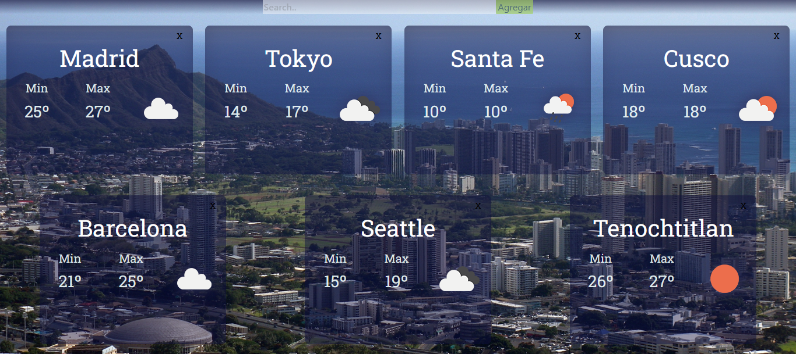
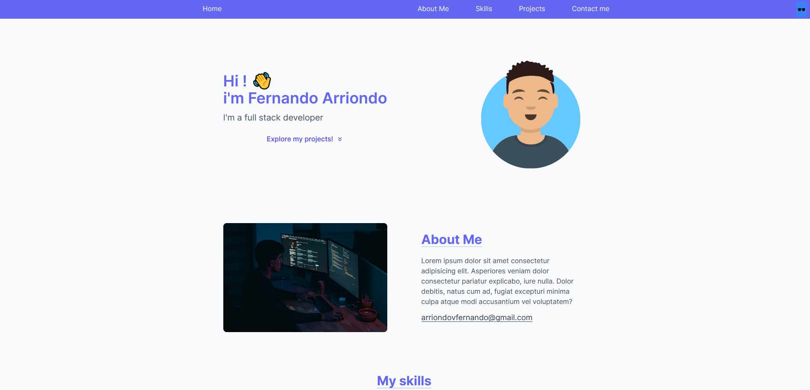

### Hi there!🤜🤛 i'm Fernando 😎  

As a Full stack web developer after finishing Henry's bootcamp, i'm looking for my first opportunity in IT. I'm a team player, kind, resilient, empathic and positive character with good communication and problem solving skills. 
As a programmer I started studying in college when i did a small course about Arduino Uno and fell in love with it. Since i've been developing arduinos and web applications in my free time until i ended up in HENRY. Now my main activity consist in continuing learning and developing real projects as i look for a permanent job opportunity. Currently i'm being part of a junior acceleration in Alkemy. 😄

Ask me about HTML, Css, React, Redux, Tailwind css, Node Express API rest, Sequelize, Postgres, MySQL.

👨‍💻 Check my new Portfolio!, i usually try to maintain it actualized -> [ferrna.github.io/Portfolio](ferrna.github.io/Portfolio)  

 

<h3 align="left">My languages and tools</h3>

  
    
  
  
  
  
  
  
  
  
<!--
  
-->

 
<h2>My individual proyects and collaborations</h2>

### My-wallet
Simple but beautiful e-wallet for keeping your finances, developed as a challenge for Alkemy acceleration
<!--

-->
Home                       |  Register 
:-------------------------:|:-------------------------:
   |  

  
### E-kommerce
E commerce tech store developed together with 5 teammates, as final group project of SoyHenry's bootcamp.
 
Home                       |  Checkout 
:-------------------------:|:-------------------------:
   |  

Z
 
Weatherapp                       |  Personal portfolio 
:-------------------------:|:-------------------------:
   |  

<h3>Feel free to reach me at</h3>

Linkedin: https://www.linkedin.com/in/fernandoarriondo/

 &nbsp;

Gmail: arriondovfernando@gmail.com

<!--
### Welcome!  :smile: My name's Fernando and I'm fullStack Developer; curious, and in constant learning.  

🛠 Here are my tech Skills: 

  JavaScript
  -
  TypeScript
  -
  React
  -
  Redux
  -
  Node.js
  -
  Css
  -
  Less
  -
  Html
    

  PostgresSQL
  -
  Sequelize
  -
  Styled components

  Express
  Git

  

  

<h2>Feel free to reach at</h2> 

Linkedin: https://www.linkedin.com/in/fernandoarriondo/

<a href="https://www.linkedin.com/in/fernandoarriondo/"> &nbsp;

Gmail: arriondovfernando@gmail.com

<a href="mailto:arriondovfernando@gmail.com">

-->

<!--
**FerrnA/FerrnA** is a ✨ _special_ ✨ repository because its `README.md` (this file) appears on your GitHub profile.

Here are some ideas to get you started:

- 🔭 I’m currently working on ...
- 🌱 I’m currently learning ...
- 👯 I’m looking to collaborate on ...
- 🤔 I’m looking for help with ...
- 💬 Ask me about ...
- 📫 How to reach me: ...
- 😄 Pronouns: ...
- ⚡ Fun fact: ...
-->

